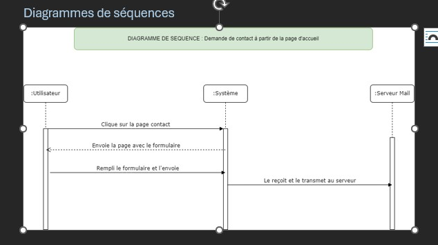

<<<<<<< HEAD
# Vite et Gourmand

<Spécialiste de la réservation de restauration rapide, l’application a pour objectif de faciliter les commandes des visiteurs en leur présentant les menus de manière simple et rapide.

## Présentation de l’entreprise

Créée il y a 25 ans à Bordeaux par Julie et José, **Vite et Gourmand** propose des prestations de menus pour tout type d’événement.  
L’application web permet d’augmenter la visibilité de l’entreprise et de présenter les menus plus facilement aux clients.

---

# Table des matières

1. Activité – Type 1 : Développer la partie front-end d'une application web ou web mobile sécurisée  
   - Installer et configurer son environnement  
   - Maquettes et interfaces utilisateur  
   - Interfaces statiques  
   - Interfaces dynamiques  

2. Activité – Type 2 : Développer la partie back-end d'une application web ou web mobile sécurisée  
   - Base de données relationnelle  
   - Accès aux données SQL / NoSQL  
   - Composants métier  
   - Déploiement de l’application  
>
---

# Diagrammes de conception

## Diagramme de cas d’usage

## Diagramme d’architecture

## Diagramme de navigation

---

# Activité – Type 1 : Développer la partie front-end

## Installer et configurer son environnement

### Backend

    - Laravel
  <

## About Laravel

Laravel is a web application framework with expressive, elegant syntax. We believe development must be an enjoyable and creative experience to be truly fulfilling. Laravel takes the pain out of development by easing common tasks used in many web projects, such as:

- [Simple, fast routing engine](https://laravel.com/docs/routing).
- [Powerful dependency injection container](https://laravel.com/docs/container).
- Multiple back-ends for [session](https://laravel.com/docs/session) and [cache](https://laravel.com/docs/cache) storage.
- Expressive, intuitive [database ORM](https://laravel.com/docs/eloquent).
- Database agnostic [schema migrations](https://laravel.com/docs/migrations).
- [Robust background job processing](https://laravel.com/docs/queues).
- [Real-time event broadcasting](https://laravel.com/docs/broadcasting).

Laravel is accessible, powerful, and provides tools required for large, robust applications.

## Learning Laravel

Laravel has the most extensive and thorough [documentation](https://laravel.com/docs) and video tutorial library of all modern web application frameworks, making it a breeze to get started with the framework. You can also check out [Laravel Learn](https://laravel.com/learn), where you will be guided through building a modern Laravel application.

If you don't feel like reading, [Laracasts](https://laracasts.com) can help. Laracasts contains thousands of video tutorials on a range of topics including Laravel, modern PHP, unit testing, and JavaScript. Boost your skills by digging into our comprehensive video library.

## Laravel Sponsors

We would like to extend our thanks to the following sponsors for funding Laravel development. If you are interested in becoming a sponsor, please visit the [Laravel Partners program](https://partners.laravel.com).

### Premium Partners

- **[Vehikl](https://vehikl.com)**
- **[Tighten Co.](https://tighten.co)**
- **[Kirschbaum Development Group](https://kirschbaumdevelopment.com)**
- **[64 Robots](https://64robots.com)**
- **[Curotec](https://www.curotec.com/services/technologies/laravel)**
- **[DevSquad](https://devsquad.com/hire-laravel-developers)**
- **[Redberry](https://redberry.international/laravel-development)**
- **[Active Logic](https://activelogic.com)**

## Contributing

Thank you for considering contributing to the Laravel framework! The contribution guide can be found in the [Laravel documentation](https://laravel.com/docs/contributions).

## Code of Conduct

In order to ensure that the Laravel community is welcoming to all, please review and abide by the [Code of Conduct](https://laravel.com/docs/contributions#code-of-conduct).

## Security Vulnerabilities

If you discover a security vulnerability within Laravel, please send an e-mail to Taylor Otwell via [taylor@laravel.com](mailto:taylor@laravel.com). All security vulnerabilities will be promptly addressed.

## License

The Laravel framework is open-sourced software licensed under the [MIT license](https://opensource.org/licenses/MIT).
# Projet-vite-et-gourmand>
  
### Frontend

    - React
    - Bootstrap

---

## Maquettes et interfaces utilisateur

### Outils de suivi de projet

Click’Up : https://app.clickup.com/90152125758/v/li/901518966291  

### Charte graphique

### Wireframes et maquettes

#### Wireframes Mobile

#### Maquettes Laptop

#### Wireframes Laptop  

#### Maquettes Mobile  

---

# Réaliser des interfaces utilisateur statiques

*(Code HTML/CSS ou captures d’écran)*

---

# Développer la partie dynamique des interfaces utilisateur

*(Fonctionnalités dynamiques : formulaires, API, interactions)*

Fonctionnalité dynamiques :
    - API
    - 

---

# Activité – Type 2 : Développer la partie back-end

## Mettre en place une base de données relationnelle

### Diagramme de cas d'utilisation

### MCD  

### MLD  

### Schéma physique  

---

## Développer des composants d’accès aux données SQL / NoSQL

*(Décricription des requêtes,  ORM,  API, etc.)*

---

## Développer des composants métier côté serveur

### Diagramme de séquence  

### Diagramme d’activité  

---

## Documenter le déploiement de l’application

*(Déploiement : serveur, hébergement, commandes, environnement)*

=======

>>>>>>> 809df83a9e4f05f8ea22e62c31bf8ac2257d10e8
