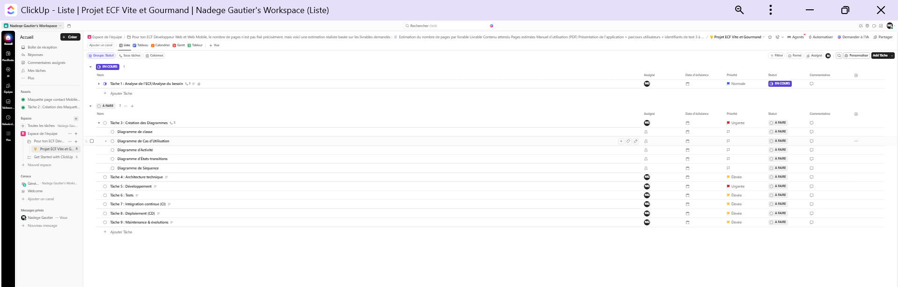
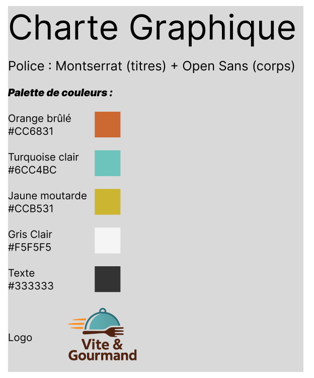
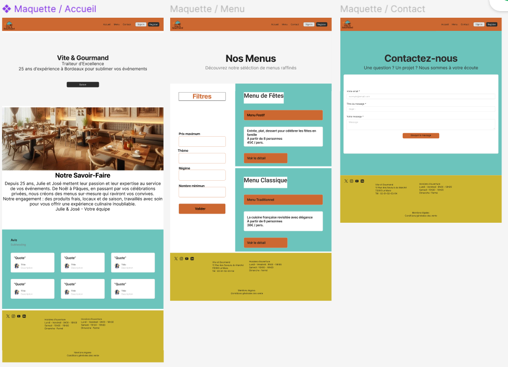
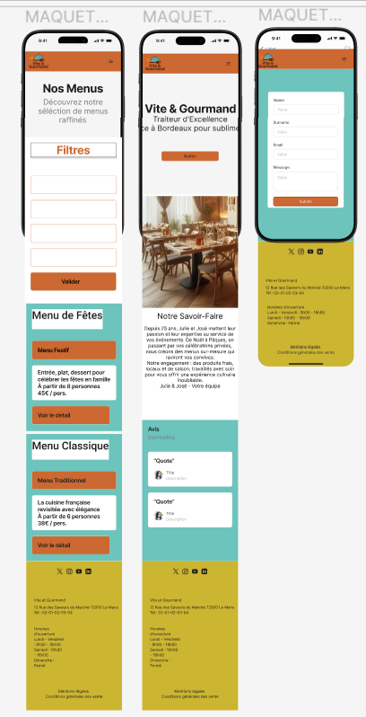
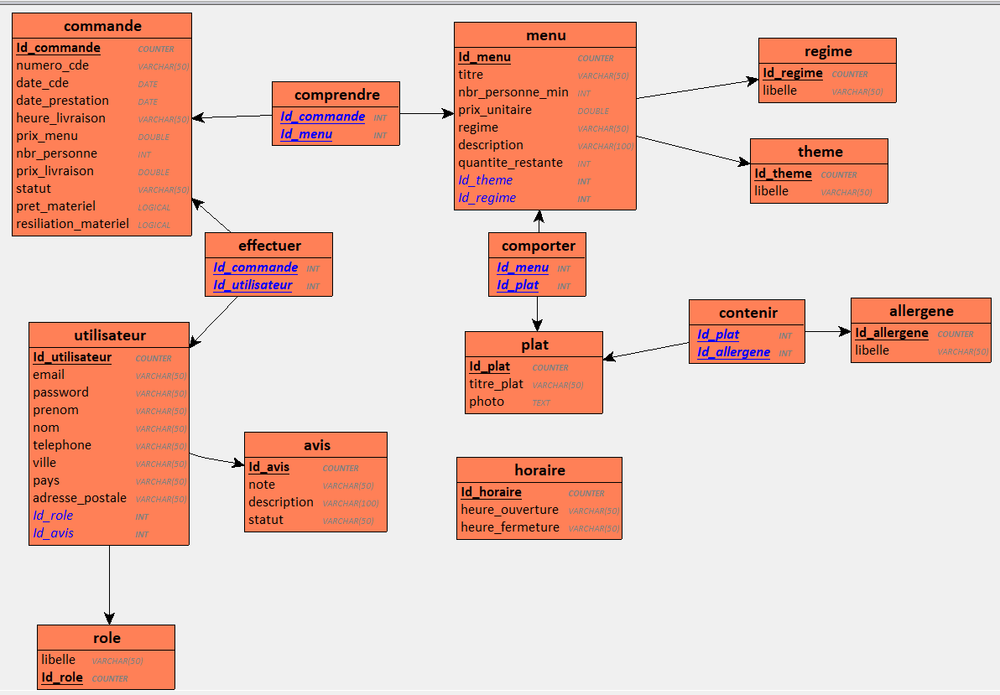
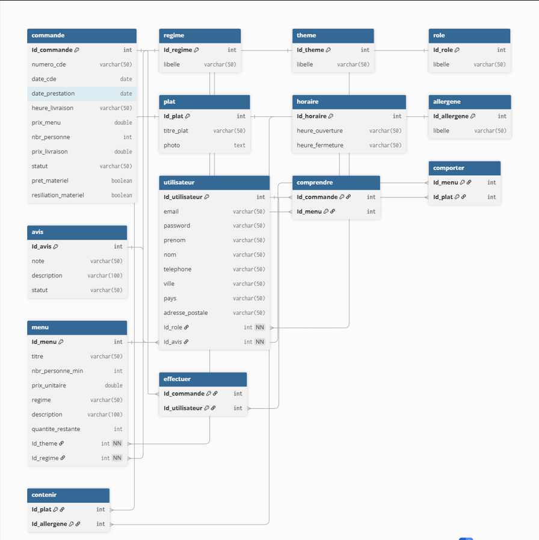
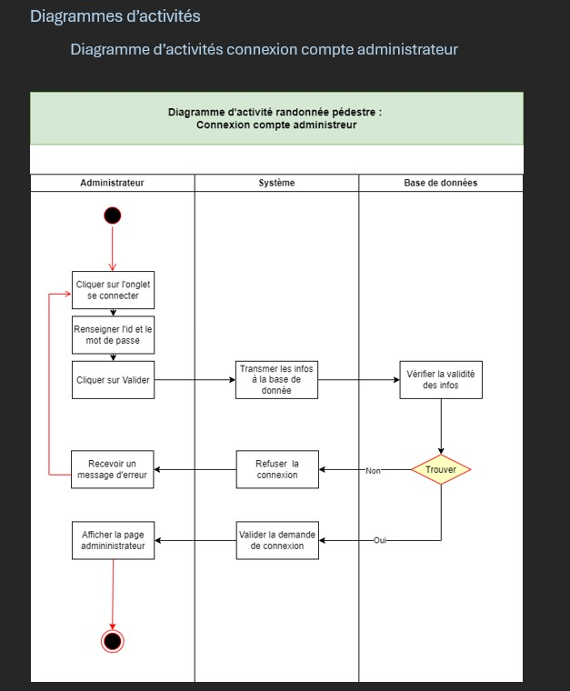

# Vite et Gourmand
Spécialiste de la réservation de restauration rapide, l'application a pour objectif de faciliter les commandes des visiteurs en leur présentant les menus de manière simple et rapide.

## Présentation de l'entreprise
Créée il y a 25 ans à Bordeaux par Julie et José, **Vite et Gourmand** propose des prestations de menus pour tout type d'événement.  
L'application web permet d'augmenter la visibilité de l'entreprise et de présenter les menus plus facilement aux clients.

---

# Table des matières
1. Activité – Type 1 : Développer la partie front-end d'une application web ou web mobile sécurisée  
   - Installer et configurer son environnement  
   - Maquettes et interfaces utilisateur  
   - Interfaces statiques  
   - Interfaces dynamiques  
2. Activité – Type 2 : Développer la partie back-end d'une application web ou web mobile sécurisée  
   - Base de données relationnelle  
   - Accès aux données SQL / NoSQL  
   - Composants métier  
   - Déploiement de l'application  

---

# Diagrammes de conception

## Diagramme de cas d'usage

## Diagramme d'architecture

## Diagramme de navigation

---

# Activité – Type 1 : Développer la partie front-end

## Installer et configurer son environnement
*(Décris ici ton environnement : Node, Vite, React, etc.)*

---

## Maquettes et interfaces utilisateur

### Outils de suivi de projet
Click'Up : https://app.clickup.com/90152125758/v/li/901518966291  

### Charte graphique

### Wireframes et maquettes

#### Wireframes Mobile

#### Maquettes Laptop

#### Wireframes Laptop  

#### Maquettes Mobile  

---

# Réaliser des interfaces utilisateur statiques
*(Ajoute ici ton code HTML/CSS ou captures d'écran)*

---

# Développer la partie dynamique des interfaces utilisateur
*(Ajoute ici les fonctionnalités dynamiques : formulaires, API, interactions)*

---

# Activité – Type 2 : Développer la partie back-end

## Mettre en place une base de données relationnelle

### Diagramme de cas d'utilisation

### MCD  

### MLD  

### Schéma physique  

---

## Développer des composants d'accès aux données SQL / NoSQL
*(Décris ici tes requêtes, ton ORM, ton API, etc.)*

---

## Développer des composants métier côté serveur

### Diagramme de séquence  

### Diagramme d'activité  

---

## Documenter le déploiement de l'application
*(Explique ici ton déploiement : serveur, hébergement, commandes, environnement)*