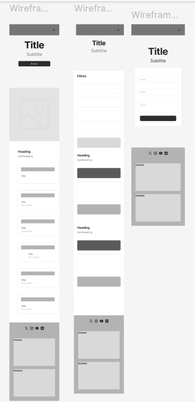
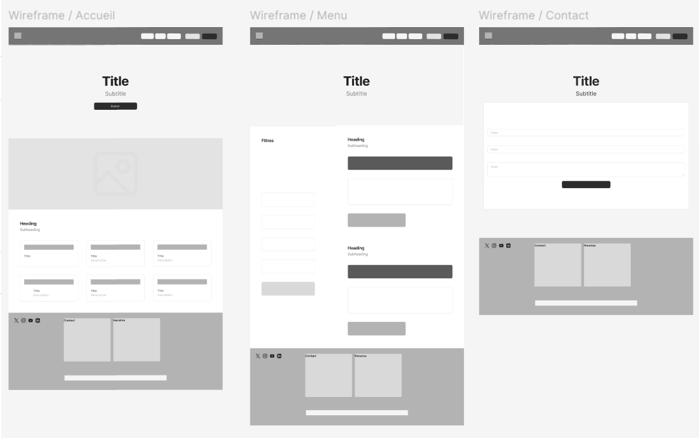
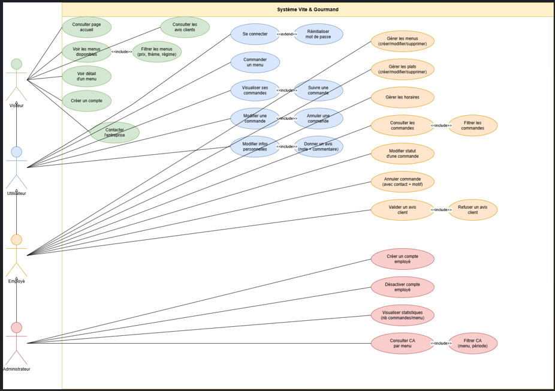
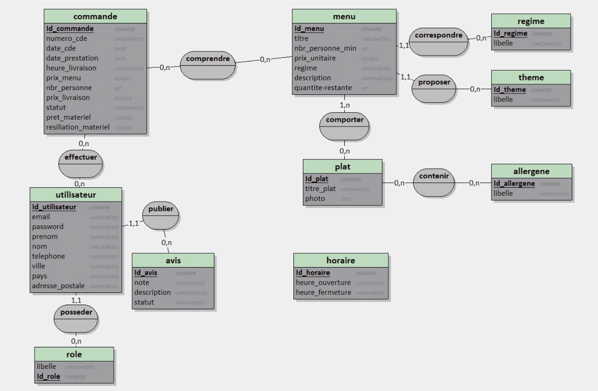
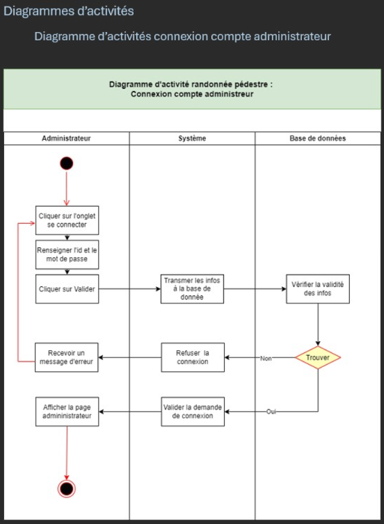

# Vite et Gourmand

Spécialiste de la réservation de restauration rapide, l’application a pour objectif de faciliter les commandes des visiteurs en leur présentant les menus de manière simple et rapide.

## Présentation de l’entreprise

Créée il y a 25 ans à Bordeaux par Julie et José, **Vite et Gourmand** propose des prestations de menus pour tout type d’événement.  
L’application web permet d’augmenter la visibilité de l’entreprise et de présenter les menus plus facilement aux clients.

---

# Table des matières

1. **Activité – Type 1 : Développer la partie front-end d'une application web ou web mobile sécurisée**

   - Installer et configurer son environnement
   - Maquettes et interfaces utilisateur
   - Interfaces statiques
   - Interfaces dynamiques

2. **Activité – Type 2 : Développer la partie back-end d'une application web ou web mobile sécurisée**
   - Base de données relationnelle
   - Accès aux données SQL / NoSQL
   - Composants métier
   - Déploiement de l’application

---

# Diagrammes de conception

## Diagramme de cas d’usage


## Diagramme d’architecture


## Diagramme de navigation


---

# Activité – Type 1 : Développer la partie front-end

## Installer et configurer son environnement

- **Technologies utilisées :**  
  - Framework : *React  
  - Gestionnaire de paquets : *npm  
  - Outils : *Vite / Webpack / ESLint / Prettier*  
  - Navigateur cible :** Chrome / Firefox / Edge
  
- **Installation du projet :**
  ```bash
  git clone https://github.com/Nade0478/Projet-vite-et-gourmand/tree/MAIN
  cd Projet-vite-et-gourmand
  npm install
  npm run dev

### Backend

- Laravel

<p align="center"><a href="https://laravel.com" target="_blank"></a></p>

<p align="center">
<a href="https://github.com/laravel/framework/actions"></a>
<a href="https://packagist.org/packages/laravel/framework"></a>
<a href="https://packagist.org/packages/laravel/framework"></a>
<a href="https://packagist.org/packages/laravel/framework"></a>
</p>

### Frontend

- React
  ## Installation de React

L’application utilise **React** pour la partie front‑end. Voici les étapes pour installer et lancer le projet.

### 1. Prérequis

Assurez‑vous d’avoir installé :

- Node.js
- npm (installé avec Node)

Vérification :

```bash
node -v
npm -v

- Bootstrap

---

## Maquettes et interfaces utilisateur
Réalisation des maquettes avec Figma
- https://www.figma.com/design/6Vb3xBvo3rBx8XYySlGOWL/Projet-Vite-et-Gourmand?node-id=8-2&p=f&t=SeDt5PiQ4oHMTbaD-0

Respect des principes :

Responsive design

Accessibilité (WCAG)

Cohérence graphique

Page d’accueil

Page de connexion

Tableau de bord utilisateur

1.3 Interfaces statiques
Intégration HTML / CSS / Framework CSS (Bootstrap…)

Composants statiques :

Header / Footer

Formulaires

Cartes / Listes

Respect des bonnes pratiques :

Sémantique HTML

CSS modulaires

Mobile-first

1.4 Interfaces dynamiques
Utilisation de JavaScript / TypeScript

Appels API (fetch / axios)

Gestion des états (Redux)

Fonctionnalités dynamiques :

Authentification

CRUD (Create, Read, Update, Delete)

Notifications / Modales


### Outils de suivi de projet

ClickUp : https://app.clickup.com/90152125758/v/li/901518966291


### Charte graphique


### Wireframes et maquettes

#### Wireframes Mobile


#### Maquettes Laptop


#### Wireframes Laptop


#### Maquettes Mobile


---

# Réaliser des interfaces utilisateur statiques

*(Code HTML/CSS ou captures d’écran)*

---

# Développer la partie dynamique des interfaces utilisateur

Fonctionnalités dynamiques :
- API
- Formulaires
- Interactions utilisateur

---

# Activité – Type 2 : Développer la partie back-end

## Mettre en place une base de données relationnelle

### Diagramme de cas d'utilisation


### MCD


### MLD


### Schéma physique


---

## Développer des composants d’accès aux données SQL / NoSQL

*(Description des requêtes, ORM, API, etc.)*

---

## Développer des composants métier côté serveur
Architecture
MVC / Clean Architecture

Routes → Controllers → Services → Models

- Fonctionnalités principales
Authentification JWT

Gestion des rôles (admin / user)

CRUD complet

Gestion des erreurs (middleware)


### Diagramme de séquence


### Diagramme d’activité


---
Tests
Tests unitaires (Jest / PHPUnit)

Tests API (Postman)

## Documenter le déploiement de l’application
Déploiement front-end
Netlify

Déploiement back-end
Render

Configuration du serveur Node / PHP

Déploiement base de données
hébergement MySQL
*(Déploiement : serveur, hébergement, commandes, environnement)*

- Sécurisation production
Variables d’environnement

HTTPS

CORS configuré

Logs et monitoring

```
