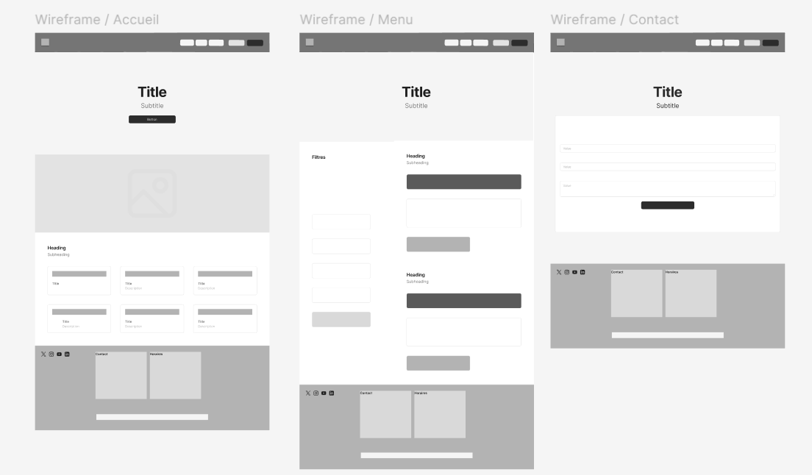
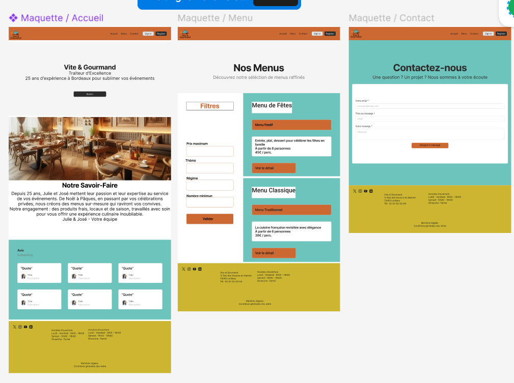

# Vite et Gourmand

. Spécialiste en réservation de restauration rapide l'application a pour but de faciliter les commande ayx visiteurs en leur montrant le menu.

## Présentation de l’entreprise

. Présentation "vite de Gourmand" a été créer il y a 25 ans à Bordeaux par Julie et José qui propose des prestations de menu pour tout événement. Cette application web permet d'augmenter la visibilité et proposer les menus plus facilement.

## Activité – Type 1 : Développer la partie front-end d'une application web ou web mobile sécurisée

### Installer et configurer son environnement de travail en fonction du projet web ou web mobile

### Maquettes des interfaces utilisateur web ou web mobile

#### Outils de suivi de projet

. Click'up : https://app.clickup.com/90152125758/v/li/901518966291

#### Charte Graphique

    #### Wareframe mobile

    #### W
    
    

####

### Réaliser des interfaces utilisateur statiques web ou web mobile

### Développer la partie dynamique des interfaces utilisateur web ou web mobile

## Activité – Type 2 : Développer la partie back-end d'une application web ou web mobile sécurisée

### Mettre en place une base de données relationnelle

### Développer des composants d'accès aux données SQL et NoSQL

### Développer des composants métier coté serveur

### Documenter le déploiement d'une application dynamique web ou web mobile
